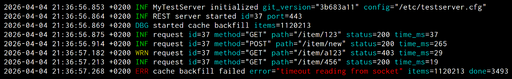
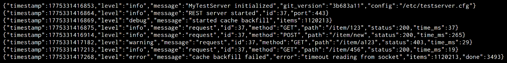

# Rasant

<p>
    <picture>
      <source media="(prefers-color-scheme: light)" srcset="https://raw.githubusercontent.com/plisandro/rasant/master/assets/rasant_title_light_horizontal.png" width="350px">
      <source media="(prefers-color-scheme: dark)" srcset="https://raw.githubusercontent.com/plisandro/rasant/master/assets/rasant_title_dark_horizontal.png" width="350px">
      
    </picture>
    <br>
</p>

[][crates-io]
[][api-docs]

Rasant is a lightweight, high performance and flexible Rust library for structured logging,
inspired by the likes of [zap](https://github.com/uber-go/zap) and [zerolog](https://github.com/rs/zerolog).

It offers [nanosecond precision](https://github.com/plisandro/ntime), stackable logging and
[outstanding performance](assets/benchmarks.md): on modern systems, Rasant can process and
dispatch logs to multiple sinks in tens of nanoseconds, being normally bottlenecked by I/O
operations. Can't wait that long? There's built-in [async support](#asynchronous-logging)!





## Main Features

  - Minimal dependencies.
  - [Blazing fast](assets/benchmarks.md) performance, with zero allocations on most operations.
  - Leveled, structured contextual logging with [nanosecond precision](https://github.com/plisandro/ntime).
  - [Simple API](#basic-examples), with support for [stacked logging](#stacking).
  - Thread safe.
  - [Highly configurable log sinks](#configuring-sinks).
  - Text and JSON log output.
  - Support for [dynamic async logging](#asynchronous-logging) with constant lock time.

## Usage 

Latest stable release is **v0.6.0**. To use it, add the `rasant` crate to your `Cargo.toml` file:

```toml
[dependencies]
rasant = "0.6.0"
```

Rasant is under active development and on track for a v1.0.0 release. You may see small public
API changes until then, but the library is otherwise stable and fully functional.

## Getting started

### Basic examples

Loggers can be easily initialized using sink defaults, and accessed via methods...

```rust
use rasant;
use rasant::ToValue;

let mut log = rasant::Logger::new();
log.add_sink(rasant::sink::stderr::default()).set_level(rasant::Level::Info);

log.set("program_name", "test");
log.info("hello world!");
log.warn_with("here's some context", [("line", 7.to_value())]);
log.debug("and i'm ignored :(");
```

...or the _much_ nicer macro API:

```rust
use rasant as r;

let mut log = r::Logger::new();
log.add_sink(r::sink::stderr::default()).set_level(r::Level::Info);

r::set!(log, program_name="test");
r::info!(log, "hello world!");
r::warn!(log, "here's some context", line = 7);
r::debug!(log, "and i'm ignored :(");
```

```
2026-04-03 17:16:03.773 +0200 [INF] hello world! program_name="test"
2026-04-03 17:16:03.773 +0200 [WRN] here's some context program_name="test" line=7
```

### Stacking

All loggers can be cheaply cloned, inheriting all settings from its parent - including
levels, sinks and fixed attributes - allowing for very flexible setups. For example, to
have all errors (or higher) within a thread logged to `stderr`:

```rust
use rasant as r;
use std::thread;

let mut log = r::Logger::new();
log.add_sink(r::sink::stdout::default()).set_level(r::Level::Info);
r::info!(log, "main logs to stdout only");

let mut thread_log = log.clone();
thread::spawn(move || {
	thread_log.add_sink(r::sink::stderr::default()).set_level(r::Level::Error);

	r::set!(thread_log, thread_id = thread::current().id());
	r::info!(thread_log, "this will not log anything");
	r::fatal!(thread_log, "but this will log to both stdout and stderr");
});
```

### Configuring Sinks

Sinks can be configured to tweak multiple parameters, including time and
overall output format.

```rust
use rasant as r;

let mut log = r::Logger::new();
log.set_level(r::Level::Info).add_sink(
    r::sink::stdout::new(r::sink::stdout::StdoutConfig {
		formatter_cfg: r::sink::format::FormatterConfig {
			format: r::sink::format::OutputFormat::Json,
			time_format: r::TimeFormat::UtcNanosDateTime,
			..r::sink::format::FormatterConfig::default()
		},
		..r::sink::stdout::StdoutConfig::default()
	})
);

r::info!(log, "hello!");
```

```
{"time":"2026-04-03 16:03:04.481888522","level":"info","message":"hello!"}
```

### Asynchronous Logging
All loggers can dynamically enable/disable async writes.

When in async mode, log operations have a slightly longer (as details are
copied into a queue) _but fixed_ lock time, making it ideal f.ex. for
logging into slow storage without compromising overall performance.

```rust
use rasant as r;

let mut log = r::Logger::new();
log.set_level(r::Level::Info).add_sink(r::sink::stdout::default());

r::info!(log, "this is writen synchronously");
log.set_async(true);
r::info!(log, "and these write");
r::warn!(log, "asynchronously, but");
r::info!(log, "in order!");
```

## Documentation

  * [API documentation][api-docs]
  * [CHANGELOG]
  * [Real-world benchmarks][benchmarks]

## To-Do's

Rasant is under active development, with more features planned for future versions.

  - New output formants (hierarchical pretty print?)
  - New sink types (f.ex. [syslog](https://en.wikipedia.org/wiki/Syslog))
  - Binary output formats, such as [CBOR](https://cbor.io/) and [protobuf](https://protobuf.dev/).
  - Configurable log filters.

## License

Rasant is distrubuted under the [MIT license][mit].


[api-docs]: https://docs.rs/rasant
[crates-io]: https://crates.io/crates/rasant
[CHANGELOG]: CHANGELOG.md
[benchmarks]: assets/benchmarks.md
[mit]: LICENSE
