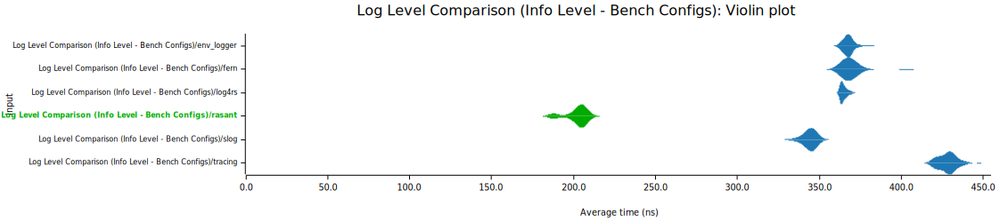
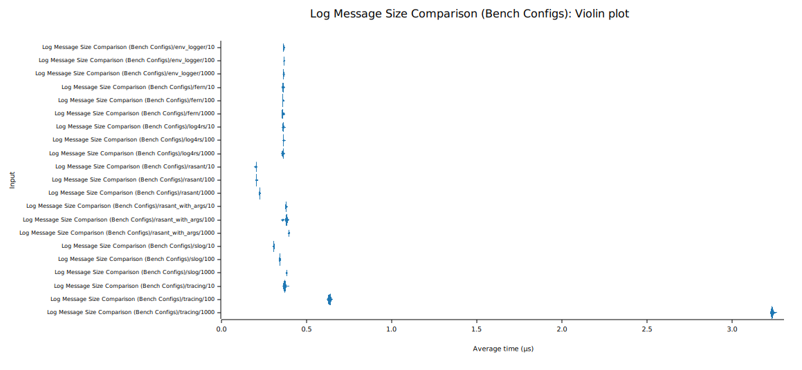

# Benchmarks 

## Third-party

### [rust_logger_benchmark](https://github.com/jackson211/rust_logger_benchmark)

This project compares the performance of multiple logging libraries for Rust, including
[log](https://crates.io/crates/log), [slog](https://crates.io/crates/slog) and
[tracing](https://crates.io/crates/tracing).

Depending on the scenario, Rasant v0.6.0 performs in average 18% to 41% faster
than [slog](https://crates.io/crates/slog), second fastest in the benchmark,
and 41% to 57% faster than [tracing](https://crates.io/crates/tracing).





## Internal

Rasant includes a number of [Divan](https://crates.io/crates/divan) benchmark tests,
intended to gauge performance progress across versions, wich can be run via
`cargo bench --profile=release`.

All figures below were collected on 16-core AMD Ryzen 9 5950X system with 64GB of DDR4 memory.

### Version 0.6.0 (2026-04-16)

Zero allocation for all attribute types, excluding long `String`s.

This version also switches bencmarking over to [Divan](https://crates.io/crates/divan), which
now encompasses log throughput, performance for different log formats, and alloc handling.

```
Timer precision: 20 ns
log_write                 fastest       │ slowest       │ median        │ mean          │ samples │ iters
├─ nested                               │               │               │               │         │
│  ├─ async_skip          60.72 µs      │ 106.1 µs      │ 74.51 µs      │ 74.04 µs      │ 100     │ 100
│  │                      164.6 Mitem/s │ 94.21 Mitem/s │ 134.1 Mitem/s │ 135 Mitem/s   │         │
│  ├─ async_write         10.88 ms      │ 25.51 ms      │ 13.27 ms      │ 13.68 ms      │ 100     │ 100
│  │                      919 Kitem/s   │ 391.9 Kitem/s │ 753.1 Kitem/s │ 730.7 Kitem/s │         │
│  ├─ skip                37.71 µs      │ 90.7 µs       │ 38.28 µs      │ 41.81 µs      │ 100     │ 100
│  │                      265.1 Mitem/s │ 110.2 Mitem/s │ 261.2 Mitem/s │ 239.1 Mitem/s │         │
│  ╰─ write               699.6 µs      │ 823.6 µs      │ 721.2 µs      │ 726.2 µs      │ 100     │ 100
│                         14.29 Mitem/s │ 12.14 Mitem/s │ 13.86 Mitem/s │ 13.77 Mitem/s │         │
├─ nested_with_arguments                │               │               │               │         │
│  ├─ async_skip          67.46 µs      │ 1.274 ms      │ 105.1 µs      │ 116.8 µs      │ 100     │ 100
│  │                      148.2 Mitem/s │ 7.846 Mitem/s │ 95.11 Mitem/s │ 85.58 Mitem/s │         │
│  ├─ async_write         16.33 ms      │ 38.71 ms      │ 17.97 ms      │ 18.24 ms      │ 100     │ 100
│  │                      612.3 Kitem/s │ 258.2 Kitem/s │ 556.4 Kitem/s │ 548 Kitem/s   │         │
│  ├─ skip                52.48 µs      │ 169.5 µs      │ 57.56 µs      │ 60.35 µs      │ 100     │ 100
│  │                      190.5 Mitem/s │ 58.98 Mitem/s │ 173.7 Mitem/s │ 165.6 Mitem/s │         │
│  ╰─ write               2.089 ms      │ 2.247 ms      │ 2.115 ms      │ 2.122 ms      │ 100     │ 100
│                         4.785 Mitem/s │ 4.448 Mitem/s │ 4.726 Mitem/s │ 4.711 Mitem/s │         │
├─ single                               │               │               │               │         │
│  ├─ async_skip          22.8 µs       │ 31.29 µs      │ 22.93 µs      │ 23.14 µs      │ 100     │ 100
│  │                      438.4 Mitem/s │ 319.4 Mitem/s │ 436 Mitem/s   │ 432 Mitem/s   │         │
│  ├─ async_write         7.378 ms      │ 14.78 ms      │ 7.919 ms      │ 8.63 ms       │ 100     │ 100
│  │                      1.355 Mitem/s │ 676.1 Kitem/s │ 1.262 Mitem/s │ 1.158 Mitem/s │         │
│  ├─ skip                25.59 µs      │ 41.57 µs      │ 25.6 µs       │ 27.49 µs      │ 100     │ 100
│  │                      390.6 Mitem/s │ 240.5 Mitem/s │ 390.4 Mitem/s │ 363.6 Mitem/s │         │
│  ╰─ write               642.7 µs      │ 740.1 µs      │ 656 µs        │ 660.3 µs      │ 100     │ 100
│                         15.55 Mitem/s │ 13.51 Mitem/s │ 15.24 Mitem/s │ 15.14 Mitem/s │         │
╰─ threaded                             │               │               │               │         │
   ├─ async_skip          1.097 ms      │ 1.655 ms      │ 1.2 ms        │ 1.24 ms       │ 100     │ 100
   │                      9.113 Mitem/s │ 6.039 Mitem/s │ 8.332 Mitem/s │ 8.059 Mitem/s │         │
   ├─ async_write         2.512 ms      │ 4.018 ms      │ 2.866 ms      │ 2.943 ms      │ 100     │ 100
   │                      3.979 Mitem/s │ 2.488 Mitem/s │ 3.488 Mitem/s │ 3.397 Mitem/s │         │
   ├─ skip                1.052 ms      │ 2.231 ms      │ 1.176 ms      │ 1.235 ms      │ 100     │ 100
   │                      9.497 Mitem/s │ 4.481 Mitem/s │ 8.499 Mitem/s │ 8.093 Mitem/s │         │
   ╰─ write               1.156 ms      │ 2.585 ms      │ 2.089 ms      │ 2.088 ms      │ 100     │ 100
                          8.647 Mitem/s │ 3.867 Mitem/s │ 4.785 Mitem/s │ 4.787 Mitem/s │         │
```

### Version 0.5.0 (2026-04-07)

Optimize handling of async log operations.

Benchmarks for v0.5.0 and earlier ran as an ad-hoc set of tests, collected
via `cargo test --release --features=benchmark -- --show-output`.

```
--- Benchmark: single logger ---
[sync]
	wrote 1000000 compact log entries in 66.124354ms, average 66ns/op
	wrote 1000000 JSON log entries in 65.969635ms, average 65ns/op
	skipped 1000000 compact log entries in 2.563116ms, average 2ns/op
	skipped 1000000 JSON log entries in 2.554296ms, average 2ns/op
[async]
	wrote 1000000 compact log entries in 837.521392ms, average 837ns/op
	wrote 1000000 JSON log entries in 824.535125ms, average 824ns/op
	skipped 1000000 compact log entries in 3.018033ms, average 3ns/op
	skipped 1000000 JSON log entries in 3.083163ms, average 3ns/op

--- Benchmark: 50 nested loggers ---
[sync]
	wrote 1000000 compact log entries in 70.662978ms, average 70ns/op
	wrote 1000000 JSON log entries in 69.322467ms, average 69ns/op
	skipped 1000000 compact log entries in 2.401866ms, average 2ns/op
	skipped 1000000 JSON log entries in 2.413617ms, average 2ns/op
[async]
	wrote 1000000 compact log entries in 1.298915357s, average 1.298µs/op
	wrote 1000000 JSON log entries in 1.313931904s, average 1.313µs/op
	skipped 1000000 compact log entries in 2.896094ms, average 2ns/op
	skipped 1000000 JSON log entries in 2.914194ms, average 2ns/op

--- Benchmark: 50 nested loggers with increasing arguments ---
[sync]
	wrote 1000000 compact log entries in 202.135191ms, average 202ns/op
	wrote 1000000 JSON log entries in 200.012082ms, average 200ns/op
	skipped 1000000 compact log entries in 2.390117ms, average 2ns/op
	skipped 1000000 JSON log entries in 2.374517ms, average 2ns/op
[async]
	wrote 1000000 compact log entries in 1.956121288s, average 1.956µs/op
	wrote 1000000 JSON log entries in 1.725901453s, average 1.725µs/op
	skipped 1000000 compact log entries in 2.913994ms, average 2ns/op
	skipped 1000000 JSON log entries in 3.106722ms, average 3ns/op

--- Benchmark: 50 multi-threaded nested loggers ---
[sync]
	wrote 1000000 compact log entries in 183.235505ms, average 183ns/op
	wrote 1000000 JSON log entries in 181.405756ms, average 181ns/op
	skipped 1000000 compact log entries in 1.252083ms, average 1ns/op
	skipped 1000000 JSON log entries in 1.238223ms, average 1ns/op
[async]
	wrote 1000000 compact log entries in 192.024197ms, average 192ns/op
	wrote 1000000 JSON log entries in 91.088975ms, average 91ns/op
	skipped 1000000 compact log entries in 1.624381ms, average 1ns/op
	skipped 1000000 JSON log entries in 1.428192ms, average 1ns/op
```

### Version 0.4.0 (2026-04-04)

Reworked attribute maps making most operations zero allocation, minor optimizations.

```
--- Benchmark: single logger ---
[sync]
	wrote 1000000 compact log entries in 68.433478ms, average 68ns/op
	wrote 1000000 JSON log entries in 68.940067ms, average 68ns/op
	skipped 1000000 compact log entries in 2.283092ms, average 2ns/op
	skipped 1000000 JSON log entries in 2.071971ms, average 2ns/op
[async]
	wrote 1000000 compact log entries in 1.068090936s, average 1.068µs/op
	wrote 1000000 JSON log entries in 859.384891ms, average 859ns/op
	skipped 1000000 compact log entries in 2.667301ms, average 2ns/op
	skipped 1000000 JSON log entries in 2.699961ms, average 2ns/op

--- Benchmark: 50 nested loggers ---
[sync]
	wrote 1000000 compact log entries in 70.754138ms, average 70ns/op
	wrote 1000000 JSON log entries in 71.062479ms, average 71ns/op
	skipped 1000000 compact log entries in 2.383622ms, average 2ns/op
	skipped 1000000 JSON log entries in 2.344671ms, average 2ns/op
[async]
	wrote 1000000 compact log entries in 1.530982379s, average 1.53µs/op
	wrote 1000000 JSON log entries in 1.395126025s, average 1.395µs/op
	skipped 1000000 compact log entries in 52.900729ms, average 52ns/op
	skipped 1000000 JSON log entries in 52.895409ms, average 52ns/op

--- Benchmark: 50 nested loggers with increasing arguments ---
[sync]
	wrote 1000000 compact log entries in 255.630361ms, average 255ns/op
	wrote 1000000 JSON log entries in 207.853134ms, average 207ns/op
	skipped 1000000 compact log entries in 2.357061ms, average 2ns/op
	skipped 1000000 JSON log entries in 2.346811ms, average 2ns/op
[async]
	wrote 1000000 compact log entries in 2.004260249s, average 2.004µs/op
	wrote 1000000 JSON log entries in 2.046578553s, average 2.046µs/op
	skipped 1000000 compact log entries in 102.952706ms, average 102ns/op
	skipped 1000000 JSON log entries in 52.896649ms, average 52ns/op

--- Benchmark: 50 multi-threaded nested loggers ---
[sync]
	wrote 1000000 compact log entries in 184.994561ms, average 184ns/op
	wrote 1000000 JSON log entries in 183.519921ms, average 183ns/op
	skipped 1000000 compact log entries in 1.272281ms, average 1ns/op
	skipped 1000000 JSON log entries in 1.334721ms, average 1ns/op
[async]
	wrote 1000000 compact log entries in 1.694335899s, average 1.694µs/op
	wrote 1000000 JSON log entries in 1.724104226s, average 1.724µs/op
	skipped 1000000 compact log entries in 1.588431ms, average 1ns/op
	skipped 1000000 JSON log entries in 1.420131ms, average 1ns/op
```

### Version 0.3.0 (2026-03-30)

Remove all `String` generation from logging codepaths, optimize attribute maps.

```
--- Benchmark: single logger ---
[sync]
	wrote 1000000 compact log entries in 95.061682ms, average 95ns/op
	wrote 1000000 JSON log entries in 90.353409ms, average 90ns/op
	skipped 1000000 compact log entries in 2.174012ms, average 2ns/op
	skipped 1000000 JSON log entries in 2.151221ms, average 2ns/op
[async]
	wrote 1000000 compact log entries in 834.480707ms, average 834ns/op
	wrote 1000000 JSON log entries in 812.074815ms, average 812ns/op
	skipped 1000000 compact log entries in 2.448651ms, average 2ns/op
	skipped 1000000 JSON log entries in 2.836612ms, average 2ns/op

--- Benchmark: 50 nested loggers ---
[sync]
	wrote 1000000 compact log entries in 190.387245ms, average 190ns/op
	wrote 1000000 JSON log entries in 184.887471ms, average 184ns/op
	skipped 1000000 compact log entries in 2.529951ms, average 2ns/op
	skipped 1000000 JSON log entries in 2.524952ms, average 2ns/op
[async]
	wrote 1000000 compact log entries in 1.244251002s, average 1.244µs/op
	wrote 1000000 JSON log entries in 1.231142195s, average 1.231µs/op
	skipped 1000000 compact log entries in 53.021519ms, average 53ns/op
	skipped 1000000 JSON log entries in 52.989749ms, average 52ns/op

--- Benchmark: 50 nested loggers with increasing arguments ---
[sync]
	wrote 1000000 compact log entries in 351.532583ms, average 351ns/op
	wrote 1000000 JSON log entries in 309.24519ms, average 309ns/op
	skipped 1000000 compact log entries in 2.607461ms, average 2ns/op
	skipped 1000000 JSON log entries in 2.746852ms, average 2ns/op
[async]
	wrote 1000000 compact log entries in 1.763556557s, average 1.763µs/op
	wrote 1000000 JSON log entries in 1.638452428s, average 1.638µs/op
	skipped 1000000 compact log entries in 53.294039ms, average 53ns/op
	skipped 1000000 JSON log entries in 53.30402ms, average 53ns/op

--- Benchmark: 50 multi-threaded nested loggers ---
[sync]
	wrote 1000000 compact log entries in 161.860448ms, average 161ns/op
	wrote 1000000 JSON log entries in 153.897705ms, average 153ns/op
	skipped 1000000 compact log entries in 1.377991ms, average 1ns/op
	skipped 1000000 JSON log entries in 1.22438ms, average 1ns/op
[async]
	wrote 1000000 compact log entries in 1.037478419s, average 1.037µs/op
	wrote 1000000 JSON log entries in 1.040988431s, average 1.04µs/op
	skipped 1000000 compact log entries in 1.455561ms, average 1ns/op
	skipped 1000000 JSON log entries in 1.503211ms, average 1ns/op
```

### Version 0.2.0 (2026-03-21)

Full async logging support.

```
--- Benchmark: single logger ---
[sync]
	wrote 1000000 compact log entries in 236.689932ms, average 236ns/op
	wrote 1000000 JSON log entries in 209.063272ms, average 209ns/op
	skipped 1000000 compact log entries in 2.544451ms, average 2ns/op
	skipped 1000000 JSON log entries in 2.554001ms, average 2ns/op
[async]
	wrote 1000000 compact log entries in 1.063850668s, average 1.063µs/op
	wrote 1000000 JSON log entries in 1.061223427s, average 1.061µs/op
	skipped 1000000 compact log entries in 3.110891ms, average 3ns/op
	skipped 1000000 JSON log entries in 3.188111ms, average 3ns/op

--- Benchmark: 50 nested loggers ---
[sync]
	wrote 1000000 compact log entries in 372.262729ms, average 372ns/op
	wrote 1000000 JSON log entries in 353.267422ms, average 353ns/op
	skipped 1000000 compact log entries in 2.507881ms, average 2ns/op
	skipped 1000000 JSON log entries in 2.525431ms, average 2ns/op
[async]
	wrote 1000000 compact log entries in 1.777245694s, average 1.777µs/op
	wrote 1000000 JSON log entries in 1.904141989s, average 1.904µs/op
	skipped 1000000 compact log entries in 53.387038ms, average 53ns/op
	skipped 1000000 JSON log entries in 52.987078ms, average 52ns/op

--- Benchmark: 50 nested loggers with increasing arguments ---
[sync]
	wrote 1000000 compact log entries in 2.953245001s, average 2.953µs/op
	wrote 1000000 JSON log entries in 2.454856859s, average 2.454µs/op
	skipped 1000000 compact log entries in 2.484861ms, average 2ns/op
	skipped 1000000 JSON log entries in 2.453261ms, average 2ns/op
[async]
	wrote 1000000 compact log entries in 8.790678239s, average 8.79µs/op
	wrote 1000000 JSON log entries in 12.053384927s, average 12.053µs/op
	skipped 1000000 compact log entries in 762.736713ms, average 762ns/op
	skipped 1000000 JSON log entries in 53.042009ms, average 53ns/op

--- Benchmark: 50 multi-threaded nested loggers ---
[sync]
	wrote 1000000 compact log entries in 822.507934ms, average 822ns/op
	wrote 1000000 JSON log entries in 783.084021ms, average 783ns/op
	skipped 1000000 compact log entries in 1.3622ms, average 1ns/op
	skipped 1000000 JSON log entries in 1.248181ms, average 1ns/op
[async]
	wrote 1000000 compact log entries in 1.567337892s, average 1.567µs/op
	wrote 1000000 JSON log entries in 1.598383052s, average 1.598µs/op
	skipped 1000000 compact log entries in 1.52001ms, average 1ns/op
	skipped 1000000 JSON log entries in 1.54654ms, average 1ns/op
```

### Version 0.1.0 (2026-03-15)

All log operations I/O perform streamed writes, with minimal string allocation.

```
--- Benchmark: single logger ---
[sync]
  wrote 1000000 compact log entries in 451.410456ms, average 451ns/op
  wrote 1000000 JSON log entries in 419.882445ms, average 419ns/op
  skipped 1000000 compact log entries in 418.184765ms, average 418ns/op
  skipped 1000000 JSON log entries in 389.581155ms, average 389ns/op

--- Benchmark: 50 nested loggers ---
[sync]
  wrote 1000000 compact log entries in 678.165075ms, average 678ns/op
  wrote 1000000 JSON log entries in 627.059056ms, average 627ns/op
  skipped 1000000 compact log entries in 544.775289ms, average 544ns/op
  skipped 1000000 JSON log entries in 416.698904ms, average 416ns/op

--- Benchmark: 50 nested loggers with increasing arguments ---
[sync]
  wrote 1000000 compact log entries in 3.281495815s, average 3.281µs/op
  wrote 1000000 JSON log entries in 3.052457605s, average 3.052µs/op
  skipped 1000000 compact log entries in 3.055929586s, average 3.055µs/op
  skipped 1000000 JSON log entries in 2.999489397s, average 2.999µs/op
```

### Version 0.0.1 (2026-03-11)

Initial proof-of-concept implementation, without async support.

```
--- Benchmark: single logger ---
[sync]
  wrote 1000000 log entries in 803.284508ms, average 803ns/op

--- Benchmark: 50 nested loggers ---
[sync]
  wrote 1000000 log entries in 1.080452264s, average 1.08µs/op

--- Benchmark: 50 nested loggers with increasing arguments ---
[sync]
  wrote 1000000 log entries in 4.999622168s, average 4.999µs/op
```
