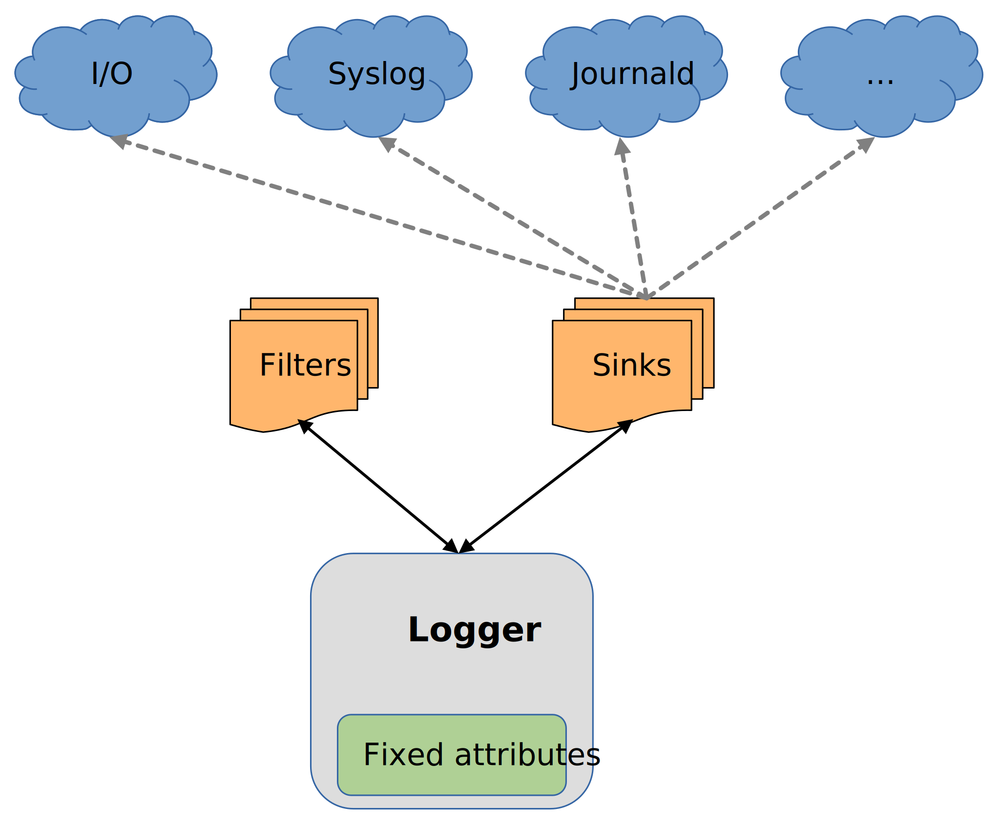
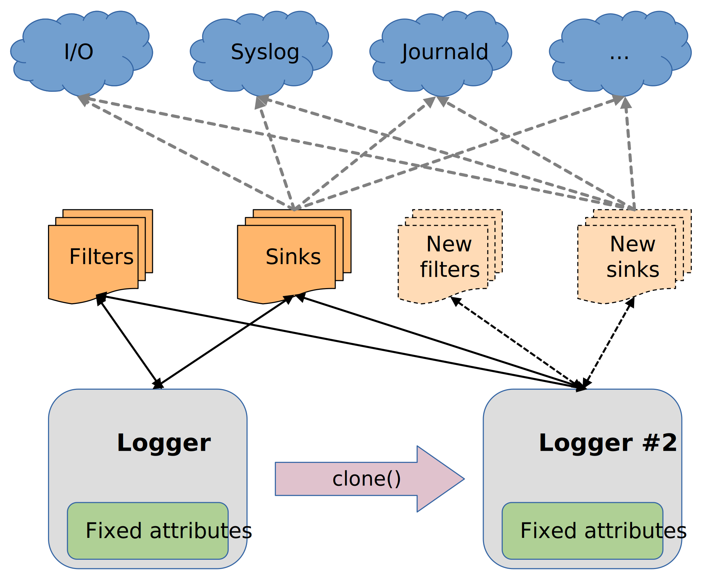
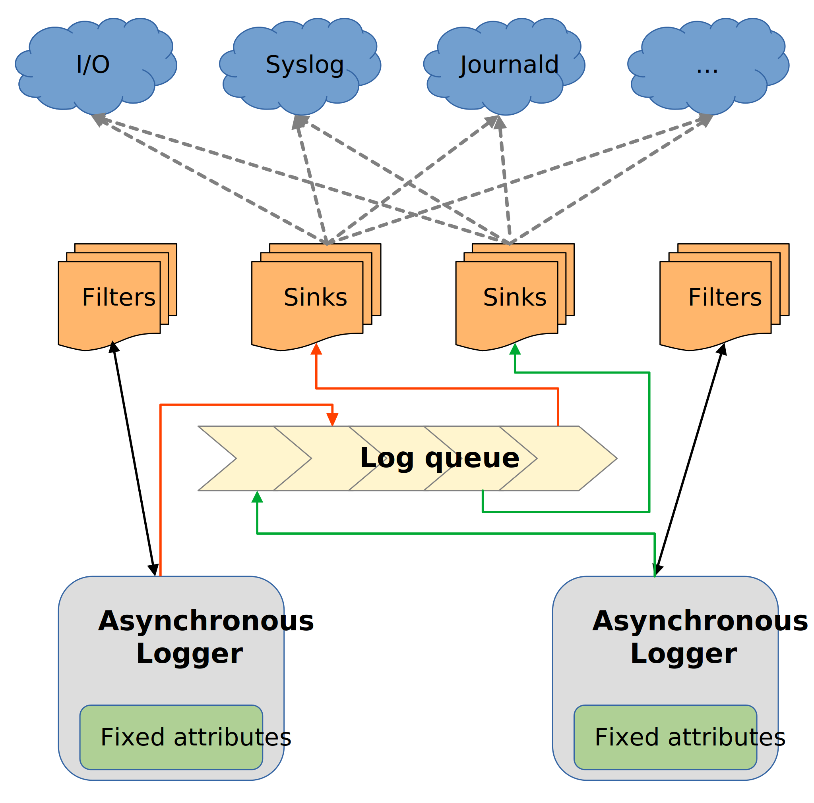

# Why Rasant?

Rasant was born as an ad-hoc log solution for a different project, which required logging
for very fast events, and fueled by a bit of frustration with existing loggers for Rust.

From the beggining, the library's goal write _correct_ log information _as fast as possible_,
with all other considerations being secondary to performance. It's still feature packed and
highly configurable, but if a new feature means sacrificing too many cycles writing log
entries to sinks, it's not implemented.

As a result, Rasant can routinely dispatch log entries to multiple sinks in tens of
nanoseconds, and it's normally bottlenecked by I/O operations.

## Architecture

Rasant is built around self-contained, independent abstractions which can be cross-referenced,
allowing very flexible setups while minimizing resource usage:

  * **Loggers** handle the processing and parsing of log requests, including
    arguments. These can be cheaply instantiated by either a `new()` constructor or
    by cloning (a.k.a _stacking_), and are also very cheap to drop.
  * **Sinks** materialize processed log requests in outputs, and can be shared across
    loggers via stacking.
  * **Filters** process log requests, and determine whether they should be written
    into sinks or not, by different criteria. These also can be stacked across loggers.

    

There is no global state in Rasant. Loggers, sinks, and filters can be independently
instantiated, and destroyed, at any time.

### Stacking

Any logger, at any time, can be very efficiently cloned. This operation copies all settings from
the parent (level, fixed attributes, sink references, filter references et al) into a new
logger instance.

This new logger will behave exactly as its parent, but it's otherwise _completely independent_
from it. Subsequent changes made on a cloned logger will not affect its parent, and viceversa.

    

What this capability unlocks is very efficient, and poweful, **stacking** of logger instances.
There's no need to rely on a global state to handle logging within functions, methods, closures,
subprocesses nor threads; loggers can be simply cloned, passed as parameters, and dropped once no
longer necessary. Cloned loggers can then change levels, modify or introduce new fixed arguments,
and even define new sinks and filters, without affecting the rest.

Sinks and filters are shared by reference, and preserve state across stacked loggers. So for
example, a rate limiting filter such as `filter::Burst` will correctly limit sink writes for
a parent logger and all its clones - and sub-clones.

### Asynchronous Logging

Any logger, at any time, can independently enable/disable asynchronous mode. Rasant keeps track
of asynchronous logger instances and, when any exists, spawns a common async queue handler running
on a dedicated thread, which is automatically destroyed once no asynchronous logger instances
are present.

This handler takes processed log requests from loggers, and executes them sequentially through a
FIFO queue, decoupling sink writes from log calls. Non-async and async loggers writing to the same
sinks can safely coexist.

    

Having an intermediate queue means log operations become slightly slower, as data needs to be
copied with each call, but it effectively gives log calls a fixed, predictable lock time, which is very
useful when sink write operations are expected to be slow.

The async queue handler is the only global abstraction in Rasant, and it's designed to be as
lightweight as possible. The handler is simple and stateless, tracking async loggers via a global
refcounts, and blindly dispatching write operations to log sinks by reference.

## Design and Behavior

The library strictly follows a few base tenets.

### Opinionated

Rasant is opinionated - for performance's sake. This means that, while flexible,
configuration and extension options are limited compared with other log libraries.

For example, formatting options are limited to a few basic types. This however
allows to tightly couple formatting with log writers, making log operations
extremely efficient.

### Log Correctness

Fast means nothing if log entries are incorrect.

Rasant ensures correctness by, among others, timestamping all log operations at
creation time instead of write time, and handling overlapping attribute definitions
cleanly so log output is never garbled.

A number of other structured log solutions tend to optimize duplicate attribute keys
checks away, which can easily lead to invalid output in formats such as JSON.

### No Intermediate Data Structures

Logging operations in involve no strings nor temporary data structures, and use of
buffers is avoided whenever possible. All log requests translate directly into log
sink writes, without processing overhead.

Log sinks themselves expose a single write endpoint, piping down to `io::Write`, which
loggers get a direct line to. As a result, log operations turn into actual I/O
writes very efficiently.

### Self-Contained Logging Abstractions

All logging abstractions (loggers themselves, sinks, filters) are designed to be
cheap, simple and self-contained. This makes loggers, and shared items such as sinks,
very efficient to instantiate, clone and destroy.

There are no global root loggers, sinks or overall state in Rasant. The only global
abstraction is a single async queue handler, shared by all loggers in asynchronous
mode, and mostly because Rust supports only native OS threads in the standard library.
This handler is otherwise stateless, blindly dispatching queued write operations to
existing log sinks.

### Zero Allocations

All items associated with a logger instance, including keys, attribute values and strings
(regardless of size) are strictly stored in a group of owned vector arrays. No other
heap allocation is ever performed.

These vectors will grow in size when needed - but never resize down. In practice, it
means that after just a few log calls vectors will grow to the size required for normal
operation, at which point all Rasant operations become effectively zero allocation.

## Comparison With Other Libraries

Rust has a wide ecosystem of mature, feature-packed logging solutions - which may
fit your needs better than Rasant.

### log

[log](https://crates.io/crates/log) is a "lightweight logging facade" maintaned by the
Rust core team, providing a common API for many logging implementations such as
[env-logger](https://crates.io/crates/env_logger), [log4rs](https://crates.io/crates/log4rs)
and [fern](https://crates.io/crates/fern).

`log`'s goals are flexibility and extensibility, which come at the cost of speed,
but it's otherwise a good, mature solution for applications where performance is not
paramount.

### tracing

[tracing](https://crates.io/crates/tracing) is [Tokio](https://crates.io/crates/tokio)'s
structured log solution, which can also be used standalone, and has over time became
the de facto log solution for most Rust projects. As such, it's well-maintained and
very mature, with plenty of third party extension crates available.

`tracing` is, however, comparatively very slow, and not well suited to log events
happening with frequencies of 100s of nanoseconds. A regular log call can easily
take 4x that ammount of time to complete.

In general, `tracing` is an excellent fit if you lean into Tokio's event-driven
model, and your processes are bound by I/O rather than CPU cycles. 

### slog

[slog](https://github.com/slog-rs/slog) is another very popular structured logging
library for Rust: battle tested, highly configurable and with plenty of third-party
support in the form of feature crates.

`slog` shares a number of design ideas with Rasant (zero allocation, async support,
lazy evaluation) and it's in general _very_ fast. It's however, slower than Rasant
because of (conscious) design decisions, such as support for external features and
a single root logger piping all operations.

`slog` also defers most processing until the time log entries are actually written,
which includes items like timestamps. This means that logged times may not match the
exact time log entries were created, specially when
[asynchronous logging](https://crates.io/crates/slog-async) is enabled.

Overall, `slog` is a strong contender for fast structured logging in Rust, and
should be specially considered if Rasant doesn't offer the feature set you're after.
